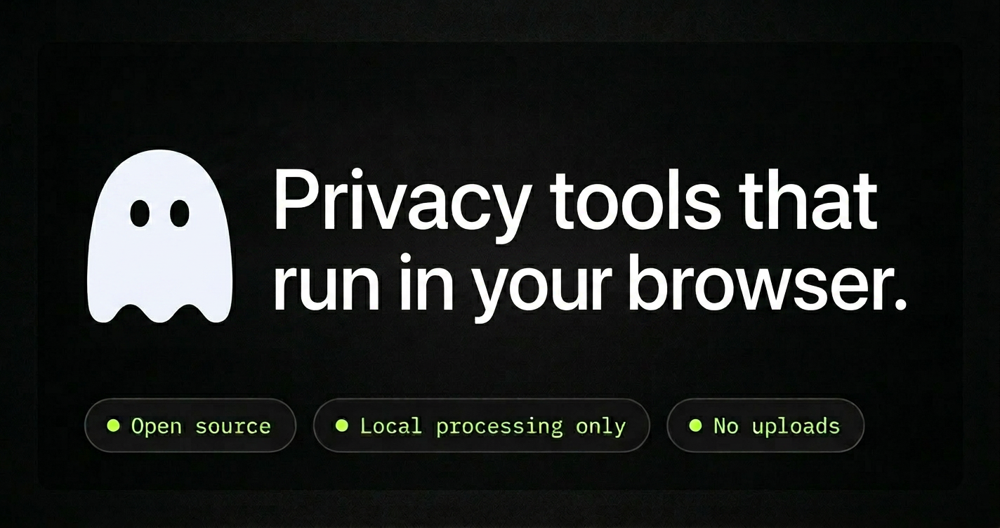

# NoTrace+
Three privacy tools in one: strip photo metadata, remove tracking parameters from URLs, and search privately.

Live: `https://notrace.plus` (Vercel)



Made by [gitpushnico](https://github.com/gitpushnico).

## Motivation
I built NoTrace+ because a lot of people (including me) don’t think about the small privacy steps that add up, like hidden photo metadata and tracking parameters in shared links.
I wanted a single, simple place to clean both in seconds, and to share practical tips that make privacy feel approachable rather than technical.

## What it does
NoTrace+ is a small, static, browser-first toolkit:

- **Photo Metadata**: removes EXIF / metadata from images and exports a clean copy.
- **URL Tracking**: removes common tracking parameters from URLs (UTM, click IDs, etc.) while preserving meaningful parameters.
- **Private Search**: opens DuckDuckGo searches in a new tab with privacy-focused settings.

## Privacy model (what’s true, precisely)
NoTrace+ is designed so you can **verify** what it does by reading the source.

- **NoTrace+ has no backend**: it’s a static site (HTML/CSS/JS).
- **We don’t receive your files or URLs**: photo processing and URL cleaning happen in your browser.
- **No analytics / no trackers**: no cookies, pixels, or third‑party analytics scripts are included.

### About “Private Search”
Private Search is still a web search engine workflow:

- Your query **is sent to DuckDuckGo** when you search (that’s unavoidable for any web search).
- DuckDuckGo will also see your **IP address** (as with any website).
- If you want to hide your IP from the search engine, use **Tor Browser** or a trusted VPN before searching.

## How it works (high level)
- **Photo Metadata**: reads the image locally, redraws/exports without metadata, and downloads the cleaned file.
- **URL Tracking**: parses the URL and removes known tracking keys; non-tracking parameters remain.
- **Private Search**: creates a DuckDuckGo URL and opens it in a new tab.

## Project structure
This repo is intentionally lightweight:

- `notrace_plus.html` — the main app (single-file HTML + CSS + JS)
- `vercel.json` — Vercel routing + security headers
- `404.html` — custom 404 page
- `og.png` — link preview image (Open Graph / Twitter)
- `logo.png` — site logo
- `icons/` — UI icons used inside the app
- `favicon/` — favicon + Apple touch icon
- `robots.txt` / `sitemap.xml` — basic SEO crawl hints

## Run locally
Just open the file in a browser:

1. Double‑click `notrace_plus.html`, or
2. Serve it locally (recommended so fonts load consistently):

```bash
python3 -m http.server 5173
```

Then open `http://localhost:5173/notrace_plus.html`.

## Deploy on Vercel (with `notrace.plus`)
One common setup:

1. Push this repo to GitHub.
2. Import the project in Vercel (Framework preset: **Other**).
3. Set the **Build Command** to empty and **Output Directory** to empty (static).
4. Add your custom domain `notrace.plus` in Vercel → Domains.
5. Update DNS at your registrar as Vercel instructs.

## Open source & license
This project is **open source** so anyone can inspect the code, verify the privacy claims, and fork/host their own version.

- **License**: MIT

